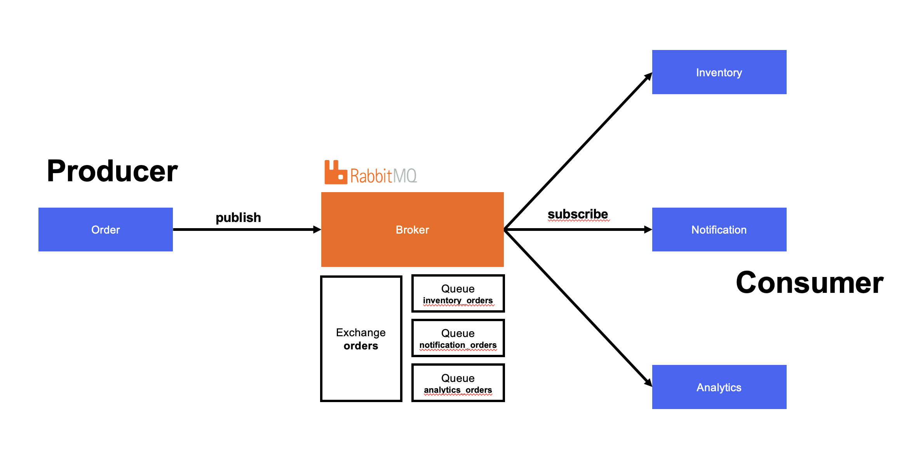

# Clothing Shop - RabbitMQ Example



## Start

```bash
# Install dependencies
npm install

# Start services with Docker
docker-compose up -d

# Place an order (after services are running)
npm run order
```

RabbitMQ UI: http://localhost:15672 (guest/guest)
